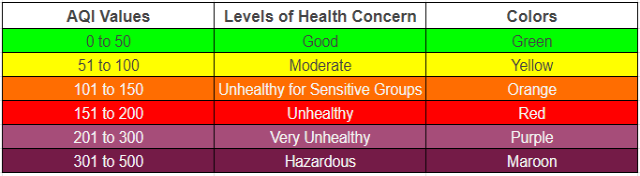

# Air Quality Index
Predict the air pollution index on a specific day in the future.

## Source 
https://www.kaggle.com/debanganthakuria/air-quality-index#train.csv

### Context

There is no denying that air pollution is impacting nature and the climate.

An Air Quality Index (AQI) value of 201 to 300 translates to very unhealthy air quality conditions for survival, with high levels of health concern. This World Meteorological Day, the government wishes to monitor the air pollution index in your city so that they can take action accordingly.

### Content
The dataset consists of certain parameters such as humidity, wind speed and direction, temperature, visibility, and more on a particular date at a mentioned time.

### Acknowledgements
This Dataset is from 'HackerEarth Machine Learning challenge: Calculate the air pollution index'

### Benefits
The benefits of practicing this problem by using Machine Learning techniques are as follows:

This challenge will encourage you to apply your Machine Learning skills to build models that can predict the air pollution index based on historical data of the climate.
This challenge will help you enhance your knowledge of time-series based regression. Regression is one of the basic building blocks of Machine Learning

### Columns 
`date_time`  
`is_holiday`  
`humidity`  
`wind_speed`  
`wind_direction`  
`visibility_in_miles`  
`dew_point`  
`temperature`  
`rain_p_h`  
`snow_p_h`  
`clouds_all`  
`weather_type`  
`air_pollution_index`  
`traffic_volume`  